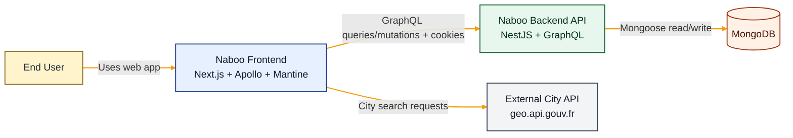
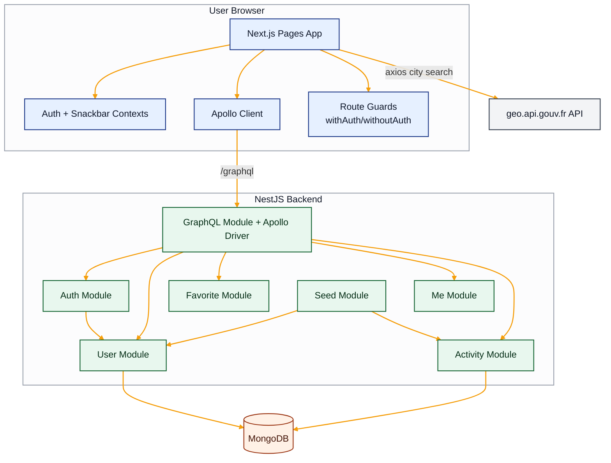
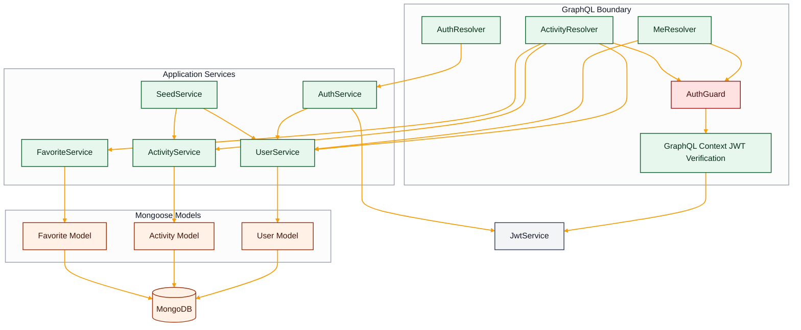
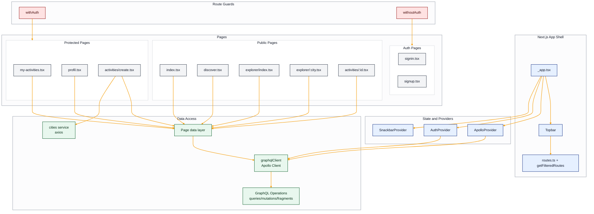

# Naboo Case Study C4 Architecture View (Current State)

This document provides C4-style views based on the implemented codebase.

## What C4 Architecture Is (and Why It Helps)

The C4 model is a lightweight way to describe software architecture using four zoom levels:
- **Level 1 - System Context:** the system, its users, and external dependencies.
- **Level 2 - Containers:** deployable/runtime units (for example web app, API, database).
- **Level 3 - Components:** major internal building blocks inside a container.
- **Level 4 - Code (optional):** low-level design details for specific classes/files.

Why this helps:
- Creates a shared architecture language for product, engineering, and new team members.
- Supports progressive detail: start high-level, zoom in only where needed.
- Improves communication during onboarding, reviews, incident analysis, and planning.

Official resources:
- C4 Model (official): https://c4model.com/
- C4 Model diagrams (official guidance): https://c4model.com/diagrams
- Simon Brown / Structurizr docs: https://docs.structurizr.com/

## 1. System Context (C4 Level 1)

## 2. Container View (C4 Level 2)

## 3. Backend Component View (C4 Level 3)

### Backend Component Responsibilities

- `GraphQL Context` (`AppModule`): extracts JWT from cookie/header and verifies payload.
- `AuthResolver`: login/register/logout GraphQL entry points and cookie set/clear.
- `MeResolver`: authenticated current-user query.
- `ActivityResolver`: activity query and mutation entry points.
- `ActivityResolver`: activity + favorites query/mutation entry points, plus admin-only `createdAt` field gating.
- `AuthGuard`: blocks GraphQL resolvers when JWT payload is missing.
- `AuthService`: credential validation, token generation, token persistence.
- `UserService`: user CRUD/query and password hashing path during user creation.
- `ActivityService`: activity query/create/filter behavior.
- `FavoriteService`: favorite list management with stable ordering and reorder validation.
- `SeedService`: initial data bootstrap.

## 4. Frontend Component View (C4 Level 3)

### Frontend Component Responsibilities

- `_app.tsx`: global provider composition and app-level layout.
- `AuthProvider`: auth state bootstrap and auth mutation workflows.
- `SnackbarProvider`: transient user notifications.
- `graphqlClient`: shared Apollo client used by SSR and client runtime.
- `withAuth` / `withoutAuth`: client-side page access gating and redirects.
- Pages: SSR queries for initial data, then component-driven rendering.

## 5. Deployment/Runtime Notes

- Frontend dev server: `http://localhost:3001`
- Backend API dev server: `http://localhost:3000`
- GraphQL endpoint: `/graphql`
- Backend REST global prefix also exists: `/api` (for non-GraphQL endpoints if added)

## 6. Architectural Constraints Observed

- Backend and frontend are separate deployable units with direct browser-to-API GraphQL traffic.
- Auth behavior relies on both HTTP-only cookie and localStorage token in current frontend implementation.
- SSR pages directly invoke shared Apollo client instance in `getServerSideProps`.
- External dependency for city suggestions is called from frontend, not proxied by backend.
