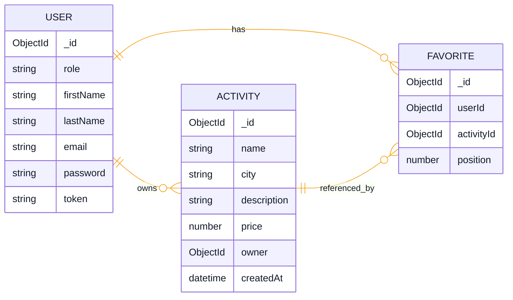
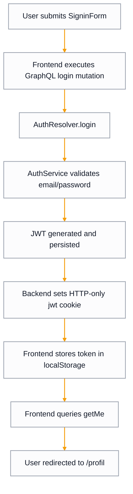
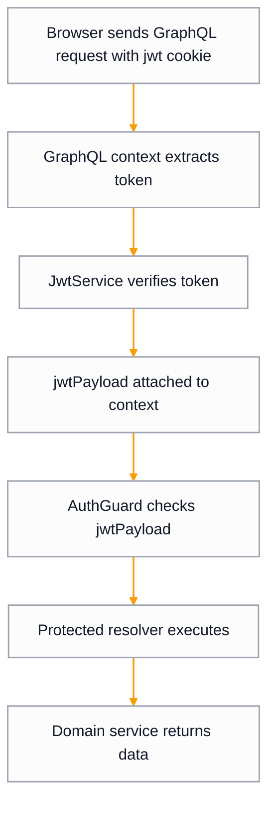
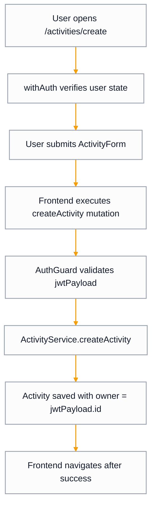

# Naboo Case Study Codebase Documentation

## 1. Overview

This repository contains two apps:

- `back-end`: a NestJS GraphQL API backed by MongoDB (Mongoose)
- `front-end`: a Next.js (Pages Router) app using Apollo Client and Mantine UI

Current user-facing capabilities include authentication (register, login, logout, current user), activity discovery, filtering by city/activity/price, authenticated activity creation, favorites management (add/remove/reorder), and profile views with user-specific activities.

## 2. Repository Structure

```text
.
├── back-end/
│   ├── src/
│   │   ├── activity/
│   │   ├── auth/
│   │   ├── favorite/
│   │   ├── me/
│   │   ├── seed/
│   │   ├── user/
│   │   ├── app.module.ts
│   │   └── main.ts
│   └── schema.gql
├── front-end/
│   └── src/
│       ├── components/
│       ├── contexts/
│       ├── graphql/
│       ├── hocs/
│       ├── hooks/
│       ├── pages/
│       ├── services/
│       └── utils/
└── docs/
```

## 3. Technology Stack

### Backend

- NestJS 10
- GraphQL via `@nestjs/graphql` + Apollo driver
- MongoDB with Mongoose
- JWT auth (`@nestjs/jwt`)
- Validation with `class-validator` + Nest `ValidationPipe`

### Frontend

- Next.js 13 (Pages Router)
- React 18
- Apollo Client
- Mantine UI + Emotion
- Axios (for external city search)
- GraphQL code generation for typed operations

## 4. Backend Architecture

### 4.1 Bootstrap and Platform Concerns

The backend entry point is `back-end/src/main.ts`. It sets a global `/api` prefix, enables `cookie-parser`, enables CORS with credentials using `FRONTEND_URL` as origin, and applies global validation through Nest's `ValidationPipe`.

### 4.2 Module Composition

`back-end/src/app.module.ts` is the root module and wires `AuthModule`, `UserModule`, `MeModule`, `ActivityModule`, and `SeedModule`.

GraphQL is configured asynchronously in `AppModule` with:

- `autoSchemaFile: 'schema.gql'`
- token extraction from `req.headers.jwt` or `req.cookies.jwt`
- JWT verification through `JwtService`, with payload injected into GraphQL context as `jwtPayload`

### 4.3 Domain Model (ER Diagram)



Relationship description:
Each `USER` can own multiple `ACTIVITY` entries, and every `ACTIVITY` belongs to exactly one `USER` through the `owner` reference.
Favorites are represented by a separate `FAVORITE` collection keyed by (`userId`, `activityId`) with an explicit `position` for stable ordering.

This diagram matches:

- `back-end/src/user/user.schema.ts`
- `back-end/src/activity/activity.schema.ts`

### 4.4 Services and Business Logic

### UserService (`back-end/src/user/user.service.ts`)

- Lookup by email/id
- User creation with bcrypt hashing
- Token persistence (`updateToken`)
- Document count helper (used by seeding patterns)

### AuthService (`back-end/src/auth/auth.service.ts`)

- `signIn`: loads user by email, compares bcrypt hash, generates JWT, persists token
- `signUp`: rejects duplicate email, delegates creation to `UserService.createUser`
- `generateToken`: signs `{id,email,firstName,lastName}`

### ActivityService (`back-end/src/activity/activity.service.ts`)

- Reads activity sets (all/latest/by user/by city/by id)
- Creates activities for authenticated users
- Returns distinct cities
- Preserves incoming order when fetching by IDs (`findByIds`)

### FavoriteService (`back-end/src/favorite/favorite.service.ts`)

- Returns a user favorite list ordered by `position`
- Adds favorites idempotently and preserves order
- Removes favorites and reindexes subsequent positions
- Reorders favorites with payload validation and two-phase updates to avoid unique index collisions

### 4.5 GraphQL Resolvers and Operations

### AuthResolver (`back-end/src/auth/auth.resolver.ts`)

Mutations:

- `login(signInInput)` -> `SignInDto` (sets `jwt` cookie on response)
- `register(signUpInput)` -> `User`
- `logout()` -> `Boolean` (clears `jwt` cookie)

### MeResolver (`back-end/src/me/resolver/me.resolver.ts`)

Query:

- `getMe()` -> `User` (guarded by `AuthGuard`)

### ActivityResolver (`back-end/src/activity/activity.resolver.ts`)

Queries:

- `getActivities()`
- `getLatestActivities()`
- `getActivitiesByUser()` (guarded)
- `getCities()`
- `getActivitiesByCity(city, activity?, price?)`
- `getActivity(id)`

Mutation:

- `createActivity(createActivityInput)` (guarded)
- `addFavoriteActivity(activityId)` (guarded)
- `removeFavoriteActivity(activityId)` (guarded)
- `reorderFavoriteActivities(activityIds)` (guarded)

Additional query:

- `getFavoriteActivities()` (guarded)

Resolve fields:

- `id` is derived from Mongo `_id`
- `owner` is resolved through the Mongoose relation
- `createdAt` is conditionally exposed only for admin users

### 4.6 Auth and Security Model (Current State)

Protected operations depend on `back-end/src/auth/auth.guard.ts`, which checks `ctx.jwtPayload`. Sessions are carried by an HTTP-only `jwt` cookie. JWT settings come from `JWT_SECRET` and `JWT_EXPIRATION_TIME`.

Current implementation notes:

- GraphQL context throws `UnauthorizedException` when token verification fails.
- GraphQL Playground is enabled (`playground: true`).
- `User.password` is exposed as a GraphQL field in the schema class.

### 4.7 Seeding

`back-end/src/seed/seed.service.ts` creates default user/admin records and seed activities (once per user bootstrap scenario).

Seed data:

- `back-end/src/seed/user.data.ts`
- `back-end/src/seed/activity.data.ts`

## 5. Frontend Architecture

### 5.1 App Shell and Providers

`front-end/src/pages/_app.tsx` sets providers in this order: `MantineProvider`, `SnackbarProvider`, `ApolloProvider` (global `graphqlClient`), then `AuthProvider`. Global navigation is rendered by `Topbar`.

### 5.2 Routing Model (Pages Router)

Public pages:

- `/`
- `/discover`
- `/explorer`
- `/explorer/[city]`
- `/signin` (redirects away when authenticated)
- `/signup` (redirects away when authenticated)

Protected pages:

- `/profil`
- `/my-activities`
- `/activities/create`

Shared detail page:

- `/activities/[id]` (SSR fetches activity data)

Route config is centralized in `front-end/src/routes.ts` and filtered by auth state via `getFilteredRoutes`.

### 5.3 Data Layer (Apollo + GraphQL)

The Apollo singleton lives at `front-end/src/graphql/apollo.ts`. The GraphQL endpoint is configurable via `NEXT_PUBLIC_GRAPHQL_URL` (fallbacks to `GRAPHQL_URL` and then `http://localhost:3000/graphql`), with cookie-based auth enabled through `credentials: "include"`.

Operations are organized by intent:

- queries: `front-end/src/graphql/queries/**`
- mutations: `front-end/src/graphql/mutations/**`
- fragments: `front-end/src/graphql/fragments/**`
- generated types: `front-end/src/graphql/generated/types.ts`

For SSR, several pages call `graphqlClient.query(...)` in `getServerSideProps`; guarded SSR pages manually forward cookies in Apollo context.

### 5.4 Auth State Management

`front-end/src/contexts/authContext.tsx` exposes:

- `handleSignin`
- `handleSignup`
- `handleLogout`

On startup, auth state checks `localStorage.token` and calls `getMe` if a token is present. Login stores the token in localStorage; logout removes it.

Route guards:

- `withAuth` redirects unauthenticated users to `/signin`
- `withoutAuth` redirects authenticated users to `/`

### 5.5 UI and Component Organization

Reusable UI components are under `front-end/src/components/*`.

Main forms:

- `SigninForm`
- `SignupForm`
- `ActivityForm`

Layout/navigation components:

- `Topbar`
- `PageTitle`

Utility and supporting modules include theme/global styles under `front-end/src/utils/*`, a debounced search hook (`useDebounced`), favorites/state hooks (`useFavorites`, `useViewMode`), and a snackbar notification context.

### 5.6 External API Integration

City autocomplete uses the French geo API via:

- service: `front-end/src/services/cities.ts`
- Axios client base: `front-end/src/services/axios.ts`

## 6. End-to-End Runtime Flows

### 6.1 Login Flow



From submit to redirect, the flow runs through credential validation, JWT issuance, cookie/session setup, and `getMe` bootstrap.

### 6.2 Authenticated Query Flow



A protected request is accepted only after JWT verification and guard checks pass.

### 6.3 Create Activity Flow



This path covers client guard checks, authenticated mutation execution, and server-side owner assignment.

## 7. Testing and Quality Gates

Backend tests include unit specs (`*.spec.ts`) and e2e setup at `back-end/test/jest-e2e.json`.

Frontend uses Vitest (`front-end/vitest.config.ts`) with examples such as:

- `PageTitle.test.tsx`
- `Topbar/getFilteredRoutes.test.ts`

Both apps include `check` and `lint` scripts.

## 8. Configuration and Environment

Backend environment variables currently used:

- `MONGO_PORT`
- `MONGO_DB_NAME`
- `MONGO_URI`
- `FRONTEND_URL`
- `FRONTEND_DOMAIN`
- `JWT_SECRET`
- `JWT_EXPIRATION_TIME`

Frontend environment variables currently used:

- `NEXT_PUBLIC_GRAPHQL_URL` (preferred)
- `GRAPHQL_URL` (fallback)

## 9. Best-Practice Patterns Implemented in Code

This section outlines engineering patterns already present in the codebase that support maintainability, correctness, and delivery consistency.

### 9.1 Backend Patterns

- Modular domain boundaries with explicit Nest modules (`AuthModule`, `UserModule`, `ActivityModule`, `FavoriteModule`, `MeModule`, `SeedModule`) reduce coupling and keep ownership clear.
- Centralized platform concerns in bootstrap/root modules: global validation pipe, CORS with credentials, cookie parsing, config-driven initialization.
- Layered GraphQL architecture (resolver -> service -> persistence model) keeps transport concerns separated from business logic.
- Guard-based authorization (`AuthGuard`) enforces protection at resolver entry points with a consistent mechanism.
- DTO and input validation using `class-validator` on GraphQL input types establishes fail-fast validation rules at API boundaries.
- Password handling follows secure primitives (`bcrypt` hashing/comparison), avoiding plain-text credential checks.
- Async configuration via `forRootAsync` and `ConfigService` supports environment-specific behavior without hardcoding secrets.
- Backend test coverage includes unit and e2e flows, providing regression protection for core service and auth scenarios.

### 9.2 Frontend Patterns

- Provider composition in `_app.tsx` centralizes cross-cutting concerns (theme, notifications, GraphQL client, auth state) in a single app shell.
- Routing concerns are separated by intent:
  - page-level routing in Next.js pages
  - navigation policy in centralized route config (`routes.ts`)
  - access enforcement through reusable HOCs (`withAuth`, `withoutAuth`)
- GraphQL operations are organized by domain and intent (queries, mutations, fragments), with generated TypeScript types for compile-time safety.
- SSR data fetching is consistently implemented with `getServerSideProps` on data-driven pages, including cookie forwarding for protected server-rendered queries.
- Custom hooks encapsulate reusable behavior (`useAuth`, `useSnackbar`, `useDebounced`) and keep components focused on rendering.
- Service-layer wrappers (`services/axios.ts`, `services/cities.ts`) isolate external API call details from UI components.
- Shared, reusable UI components (`components/*`) and route filtering utilities improve consistency and reduce duplicated logic.
- Frontend tests (Vitest + Testing Library) cover shared UI and route utility logic as a baseline quality gate.

### 9.3 Cross-Cutting Patterns

- End-to-end GraphQL contract flow is established:
  - backend schema generation
  - frontend schema sync/codegen
  - typed operation consumption in UI/state logic
- TypeScript-first development on both apps improves refactor confidence and reduces runtime-type defects.
- Scripted quality commands (`check`, `lint`, `test`) in each app establish repeatable local verification steps.
- Environment-driven runtime behavior is already used in critical backend concerns (database, CORS origin, JWT secrets/settings).

## 10. Risks and Architectural Gaps (Current State)

> Warning: this section includes active security-relevant gaps in the current implementation.

Security-relevant gaps:

- Some production-sensitive settings are currently permissive: GraphQL Playground is enabled, and `User.password` is exposed in the GraphQL model.
- Auth state is split between cookie-based sessions and a localStorage token.

Architecture and maintainability gaps:

- The shared Apollo singleton is reused across SSR and client contexts.
- Frontend code relies heavily on barrel exports (`components/index.ts`, hooks/contexts/services indexes).

## 11. How to Run

Backend:

```bash
cd back-end
npm i
npm run start:dev
```

Frontend:

```bash
cd front-end
npm i
npm run dev
```

Regenerate GraphQL types after schema changes:

```bash
cd front-end
npm run generate-types
```
