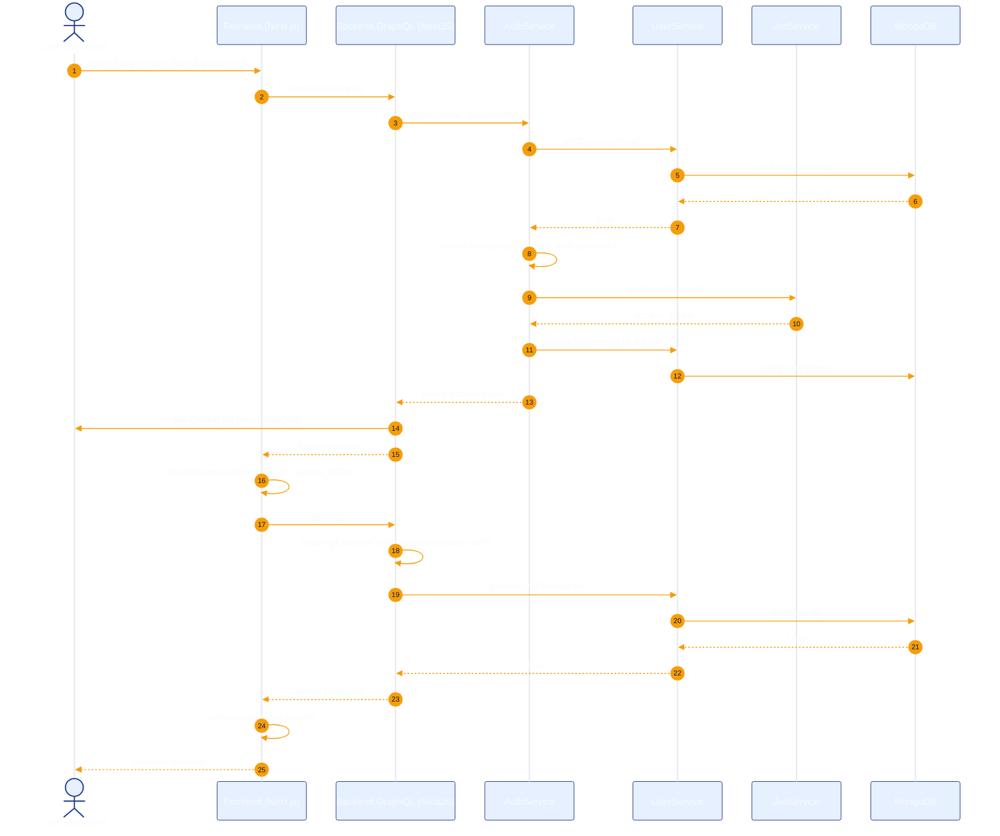
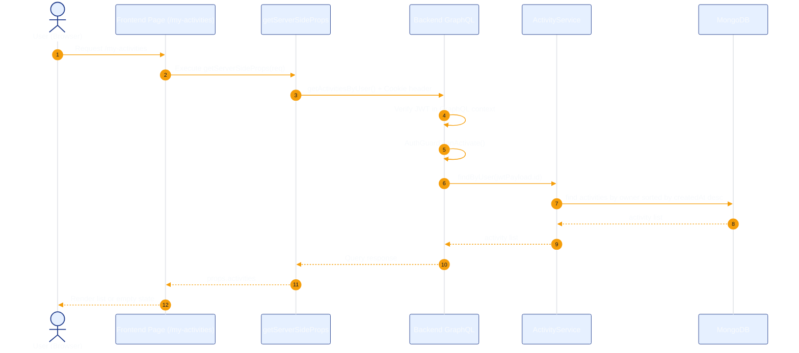
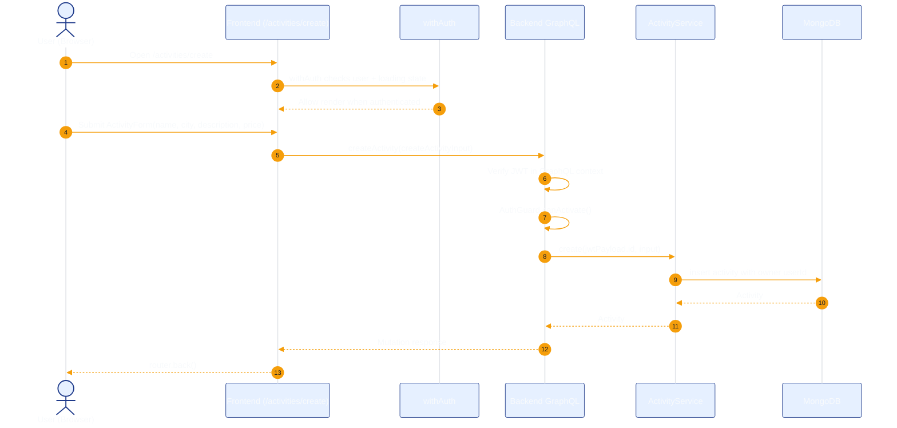
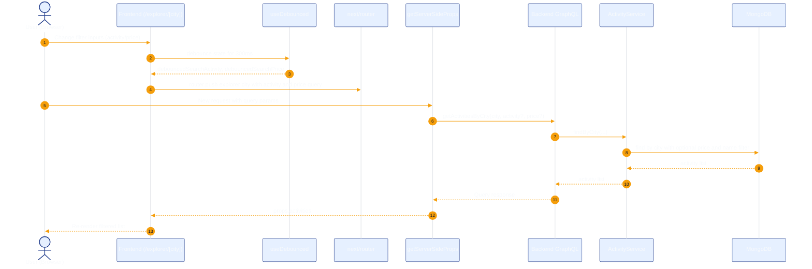

# Naboo Case Study Sequence Diagrams

This document captures current implemented runtime flows.

## 1. Login and Session Bootstrap

## 2. Authenticated Query: My Activities

## 3. Create Activity (Guarded Mutation)

## 4. Explorer City Filter Update Loop

